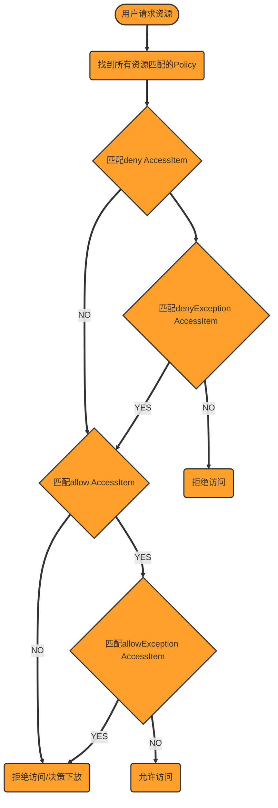

```mermaid
graph TD
   A([用户请求资源])
 ==> B(找到所有资源匹配的Policy)
==> C{匹配deny AccessItem} == NO ==> F{匹配allow AccessItem}

C ==> D{匹配denyException AccessItem} == NO ==> E(拒绝访问)

D == YES ==> F == NO ==> G(拒绝访问/决策下放)

F ==YES ==> I{匹配allowException AccessItem} == YES ==>G

I == NO  ==> H(允许访问) 

	style A fill:#ff9f2e, stroke: #333, stroke-width: 2px;
	style B fill:#ff9f2e, stroke: #333, stroke-width: 2px;
	style C fill:#ff9f2e, stroke: #333, stroke-width: 2px;
	style D fill:#ff9f2e, stroke: #333, stroke-width: 2px;
	style E fill:#ff9f2e, stroke: #333, stroke-width: 2px;
	style F fill:#ff9f2e, stroke: #333, stroke-width: 2px;
	style G fill:#ff9f2e, stroke: #333, stroke-width: 2px;
	style H fill:#ff9f2e, stroke: #333, stroke-width: 2px;
	style I fill:#ff9f2e, stroke: #333, stroke-width: 2px;
	
```
