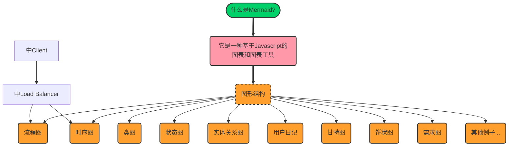

```mermaid
graph TD
      xA[中Client] --> xB[中Load Balancer]
      xB --> C[中Server1]
      xB --> D[中Server2]

	A([什么是Mermaid?]) ==> B(它是一种基于Javascript的图表和图表工具) ==> a(图形结构)
	style A fill:#00d26a, stroke: #333,stroke-width: 2px
	style B fill:#f9a, stroke: #333, stroke-width: 2px;
	
	a --> C(流程图) & D(时序图) & E(类图) & F(状态图) & G(实体关系图) & H(用户日记) & I(甘特图) & K(饼状图) & L(需求图) & M(其他例子...)
	
	style a fill:#ff9f2e, stroke: #333, stroke-width: 2px, stroke-dasharray: 5 5;
	style C fill:#ff9f2e, stroke: #333, stroke-width: 2px;
	style D fill:#ff9f2e, stroke: #333, stroke-width: 2px;
	style E fill:#ff9f2e, stroke: #333, stroke-width: 2px;
	style F fill:#ff9f2e, stroke: #333, stroke-width: 2px;
	style G fill:#ff9f2e, stroke: #333, stroke-width: 2px;
	style H fill:#ff9f2e, stroke: #333, stroke-width: 2px;
	style I fill:#ff9f2e, stroke: #333, stroke-width: 2px;
	style K fill:#ff9f2e, stroke: #333, stroke-width: 2px;
	style L fill:#ff9f2e, stroke: #333, stroke-width: 2px;
	style M fill:#ff9f2e, stroke: #333, stroke-width: 2px;
```
